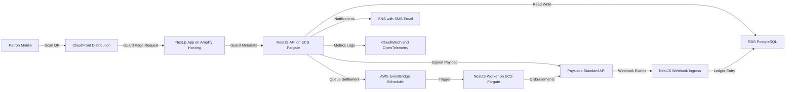

# Security Guard QR Tipping Solution Architecture (Paystack, Next.js, NestJS, AWS)

## 1. Executive Overview

Deliver a QR based tipping experience where each security guard receives a personalized QR code linked to a responsive landing page. Patrons can scan, pick a preset or custom amount, and complete payment through Paystack. Operations staff manage guard profiles and QR codes, while finance teams reconcile payouts and settlements.

## 2. High Level Architecture

### Core Components

- **Next.js Frontend**
  - Customer facing guard landing pages rendered statically with ISR for cache efficiency.
  - Staff dashboard for guard onboarding, QR generation, reporting.
  - Hosted on AWS Amplify Hosting behind CloudFront with custom domain and WAF.
- **NestJS Backend Services**
  - API service deployed as container images on ECS Fargate with ALB and auto scaling.
  - Worker service sharing codebase for asynchronous settlement and notification jobs.
  - Exposed routes protected by AWS WAF and authenticated via Cognito.
- **Data Storage**
  - Amazon RDS PostgreSQL with read replica for analytics.
  - S3 for QR images, guard photos, and static assets.
  - DynamoDB optional table for idempotency keys and rate limit counters (fast access).
- **Payments & Settlement**
  - Paystack Standard API for session checkout; inline on mobile friendly pages.
  - Paystack Transfers for payouts to guard bank accounts or mobile wallets.
  - Webhooks processed via dedicated ingress validating Paystack signatures.
- **Identity & Access**
  - Amazon Cognito: admin/finance multi factor login, guard self service portal.
  - SSO integration for corporate staff via SAML if needed later.
- **Observability & Ops**
  - CloudWatch Logs, metrics, dashboards.
  - OpenTelemetry exporter to Datadog or Honeycomb for traces.
  - AWS Backup and RDS snapshots; GuardDuty and Security Hub for posture.

## 3. Domain Model (Conceptual)

| Entity                 | Key Fields                                                                                          | Notes                                                               |
| ---------------------- | --------------------------------------------------------------------------------------------------- | ------------------------------------------------------------------- |
| Guard                  | guard_id, first_name, last_name, employee_id, payout_account_ref, status, photo_url                 | Status drives landing page availability                             |
| GuardQR                | qr_id, guard_id, url_token, status, created_at, revoked_at                                          | url_token maps to short path e.g., `/g/{token}`                     |
| TipTransaction         | tip_id, guard_id, amount, currency, patron_alias, paystack_reference, status, source_ip, created_at | Status transitions: initiated, pending, succeeded, failed, refunded |
| LedgerEntry            | entry_id, tip_id, guard_id, net_amount, fees, payout_batch_id, recorded_at                          | Used for finance reconciliation                                     |
| PayoutBatch            | batch_id, guard_id, total_amount, scheduled_for, status, transfer_reference                         | Generated daily or configurable cadence                             |
| NotificationPreference | guard_id, channel, opted_in, updated_at                                                             | Controls SMS, email, push                                           |

## 4. Key Product Flows

### Patron Tipping Flow

1. Guard shares QR code printed or digital.
2. Patron scans QR; CloudFront routes to `/g/{token}` Next.js route.
3. Next.js fetches guard metadata via SSR call to NestJS API; caches response for 60 seconds.
4. Page renders guard info and preset amounts; patron selects or inputs amount.
5. Frontend calls `POST /tips` to create pre-authorization; backend validates guard status, amount bounds, idempotency key.
6. Backend generates Paystack transaction via Standard API, returns authorization URL embedded for redirect or inline widget.
7. Patron completes payment; Paystack redirects to success URL and issues server to server webhook.
8. Webhook handler verifies signature, updates TipTransaction to succeeded, writes LedgerEntry, enqueues notification.
9. Guard receives notification of tip; finance dashboard reflects near real time status.

### Guard Onboarding & QR Provisioning

1. Ops creates guard profile in admin portal; uploads photo, sets payout account.
2. Backend persists guard and triggers QR generation job to mint signed token stored in GuardQR table.
3. Next.js admin UI renders QR preview with fallback short URL; staff downloads or emails to guard.
4. Regeneration invalidates previous token (status set to revoked) and caches expire.
5. Guard portal uses Cognito auth to show active QR status and tip history.

### Settlement & Payout

1. Nightly EventBridge schedule calls worker endpoint to aggregate LedgerEntries per guard.
2. Worker calculates fees, net amount, verifies payout threshold, and initiates Paystack Transfer.
3. Transfer response recorded; tip statuses moved to settled.
4. Finance can export CSV via admin portal; mismatches flagged in reconciliation queue.
5. Failed transfers push alerts to ops channel; auto retry with exponential backoff.

## 5. Security, Compliance, Reliability

- **Transport Security**: Enforce HTTPS via CloudFront and ALB; enable HSTS, TLS 1.2 minimum.
- **Application Security**: CSRF tokens on admin forms, JWT validation on APIs, input sanitization, rate limiting using AWS WAF and DynamoDB counters.
- **Secrets Management**: Paystack keys and DB credentials stored in AWS Secrets Manager with rotation.
- **Compliance**: PCI DSS scope minimized by using Paystack hosted fields; retain audit logs for 7 years using S3 Glacier.
- **Resilience**: Multi AZ RDS deployment, ECS services across multiple AZs, SQS buffering between webhook handler and worker to absorb spikes.
- **Monitoring**: CloudWatch alarms for p95 latency, error rates, Paystack webhook failures, settlement backlog.

## 6. CI CD and Environments

- **Source Control**: Monorepo with Nx or Turborepo managing Next.js and NestJS packages.
- **Pipeline**: GitHub Actions (or AWS CodePipeline) building Docker images, running unit/integration tests, security scans (Snyk), deploying via CDK/Terraform.
- **Environments**: dev, staging, production with isolated AWS accounts (via AWS Organizations). Feature toggles managed via LaunchDarkly or custom config table.

## 7. Phased Implementation Roadmap

| Phase                                                     | Scope                                                       | Key Deliverables                                                                                    |
| --------------------------------------------------------- | ----------------------------------------------------------- | --------------------------------------------------------------------------------------------------- |
| **Phase 0: Foundation (2 weeks)**                         | Project scaffolding, CI CD, infrastructure baseline         | Monorepo setup, IaC for VPC, RDS, ECS, Amplify, Cognito, baseline NestJS and Next.js apps           |
| **Phase 1: Core Patron Flow (4 weeks)**                   | Guard landing pages, Paystack integration, QR generation    | Guard CRUD, QR issuance, tip initiation, Paystack checkout, webhook ingestion, tip history views    |
| **Phase 2: Finance & Settlement (3 weeks)**               | Ledger, payout automation, reporting                        | Ledger model, daily scheduler, Paystack Transfers, finance dashboard, CSV exports                   |
| **Phase 3: Notifications & Security Hardening (3 weeks)** | Guard notifications, rate limiting, monitoring              | Notification preferences, SNS integration, WAF rules, DynamoDB throttling, observability dashboards |
| **Phase 4: Scaling & Enhancements (ongoing)**             | Multi tenant support, analytics, additional payment options | Idempotent retries, analytics warehouse, SLA tuning, optional mobile apps                           |

## 8. Next Steps

1. Confirm AWS account strategy and choose infrastructure as code tool (CDK vs Terraform).
2. Validate Paystack account features for transfers and webhooks in target countries.
3. Finalize amount presets and UX copy with stakeholders.
4. Kick off Phase 0 tasks in code mode once architecture is approved.
